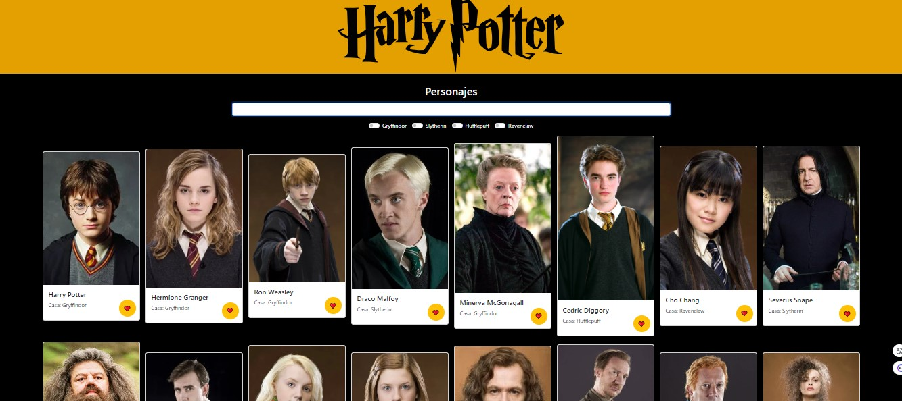

# Harry Potter Vue App

Este es un proyecto de una aplicación web desarrollada con Vue.js que muestra información sobre los personajes de Harry Potter.
## Despliegue

El proyecto está desplegado en [https://harry-potter-beta.vercel.app/](https://harry-potter-beta.vercel.app/).

## Tecnologías Utilizadas

- Vue.js
- Bootstrap
- Fetch API
  
## Cómo Ejecutar

1. Clona este repositorio.
2. Abre el archivo `index.html` en tu navegador.

## Captura de Pantalla

- **HTML (HyperText Markup Language)**: Lenguaje de marcado estándar para la creación de páginas web.
  
  - **CSS (Cascading Style Sheets)**: Se utiliza para aplicar estilos y diseñar la presentación de la página web.
  
  - **Bootstrap**: Se hace referencia a la biblioteca de Bootstrap a través de un enlace CDN. Bootstrap proporciona componentes y estilos predefinidos para la creación de interfaces de usuario.

  - **Vue.js**: Se incluye Vue.js mediante un enlace CDN. Vue.js es un framework progresivo de JavaScript utilizado para construir interfaces de usuario interactivas y de una sola página.

  El archivo `main.js` contiene la lógica de la aplicación Vue.js, incluyendo la gestión de datos, solicitudes a la API, filtrado y manejo de favoritos.
